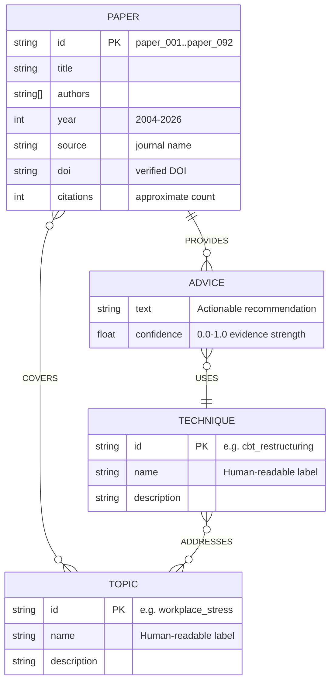

# Knowledge Graph Schema

## Entity-Relationship Diagram



## Neo4j Node Labels & Properties

### `:Paper`
| Property     | Type     | Description                           |
|-------------|----------|---------------------------------------|
| `id`        | String   | Unique identifier (paper_001–092)     |
| `title`     | String   | Full paper title                      |
| `authors`   | String[] | Author list                           |
| `year`      | Integer  | Publication year                      |
| `source`    | String   | Journal/venue name                    |
| `doi`       | String   | Verified DOI                          |
| `citations` | Integer  | Approximate citation count            |

### `:Topic`
| Property      | Type   | Description                    |
|--------------|--------|--------------------------------|
| `id`         | String | Unique slug (e.g. `burnout`)   |
| `name`       | String | Display name                   |
| `description`| String | Brief explanation               |

### `:Technique`
| Property      | Type   | Description                              |
|--------------|--------|------------------------------------------|
| `id`         | String | Unique slug (e.g. `cbt_restructuring`)   |
| `name`       | String | Display name                             |
| `description`| String | Brief explanation                         |

### `:Advice`
| Property     | Type   | Description                                    |
|-------------|--------|-------------------------------------------------|
| `text`      | String | Actionable recommendation text                  |
| `confidence`| Float  | Evidence strength score (0.0–1.0)               |

## Relationship Types

| Relationship     | From        | To          | Description                              |
|-----------------|-------------|-------------|------------------------------------------|
| `COVERS`        | Paper       | Topic       | Paper studies this mental health topic    |
| `PROVIDES`      | Paper       | Advice      | Paper yields this recommendation         |
| `USES`          | Advice      | Technique   | Advice recommends this technique          |
| `ADDRESSES`     | Technique   | Topic       | Technique is applicable to this topic     |

## Graph Statistics (v3)

| Metric                | Count  |
|-----------------------|--------|
| Papers                | 92     |
| Advice items          | 368    |
| Topics                | 24     |
| Techniques            | 37     |
| COVERS relationships  | ~350   |
| PROVIDES relationships| 368    |
| USES relationships    | 368    |
| ADDRESSES relationships| ~120  |
| Unique verified DOIs  | 91     |
| Year range            | 2004–2026 |
| Avg confidence        | ~0.76  |

## Topic Catalog (24)

| ID | Name |
|----|------|
| `workplace_stress` | Workplace Stress |
| `burnout` | Burnout & Exhaustion |
| `anxiety` | Workplace Anxiety |
| `depression` | Occupational Depression |
| `sleep_issues` | Sleep & Fatigue |
| `mindfulness` | Mindfulness |
| `emotional_regulation` | Emotional Regulation |
| `workplace_bullying` | Workplace Bullying & Harassment |
| `work_life_balance` | Work-Life Balance & Detachment |
| `resilience` | Resilience & Coping |
| `interpersonal_conflict` | Communication & Conflict |
| `digital_interventions` | Digital & eHealth Interventions |
| `physical_activity` | Physical Activity & Exercise |
| `cognitive_distortions` | Cognitive Distortions & CBT |
| `act_values` | ACT & Values-Based Action |
| `organizational_culture` | Organizational Culture & Safety |
| `anger_management` | Anger & Aggression |
| `occupational_health` | Occupational Health & Prevention |
| `self_compassion` | Self-Compassion & Perfectionism |
| `expressive_writing` | Expressive Writing |
| `social_isolation` | Remote Isolation |
| `time_poverty` | Time Poverty |
| `biofeedback` | Biofeedback & Physiological Regulation |
| `perfectionism` | Perfectionism |

## Technique Catalog (37)

| ID | Name |
|----|------|
| `mindfulness_meditation` | Mindfulness Meditation (MBSR/MBRT) |
| `mindful_breathing` | Mindful Breathing Micro-Practices |
| `body_scan` | Body Scan Meditation |
| `cbt_restructuring` | Cognitive Restructuring (CBT) |
| `behavioral_activation` | Behavioral Activation |
| `problem_solving` | Problem-Solving Therapy |
| `self_monitoring` | Self-Monitoring & Tracking |
| `psychological_detachment` | Psychological Detachment & Recovery |
| `boundary_setting` | Boundary Setting |
| `job_crafting` | Job Crafting & Organizational Change |
| `micro_breaks` | Micro-Break Strategies |
| `digital_programs` | Digital/Online Intervention Programs |
| `act_defusion` | ACT: Defusion & Values Clarification |
| `sleep_hygiene` | Sleep Hygiene & Wind-Down Routines |
| `cbti` | CBT for Insomnia (CBT-i) |
| `hrv_biofeedback` | HRV Biofeedback & Resonance Breathing |
| `paced_breathing` | Paced & Diaphragmatic Breathing |
| `exercise` | Structured Exercise |
| `expressive_writing` | Expressive Writing & Journaling |
| `self_compassion_exercise` | Self-Compassion Exercises |
| `social_support` | Peer & Social Support |
| `mental_health_literacy` | Mental Health Literacy & Help-Seeking |
| `communication_skills` | Communication Skills Training |
| `assertiveness` | Assertiveness Training |
| `bystander_intervention` | Bystander Intervention |
| `cyclic_sighing` | Cyclic Sighing |
| `box_breathing` | Box Breathing |
| `progressive_muscle` | Progressive Muscle Relaxation |
| `strategic_napping` | Strategic Timed Napping |
| `gratitude_practice` | Gratitude Practice |
| `emotional_labeling` | Emotional Labeling |
| `common_humanity` | Common Humanity Reframing |
| `time_management` | Scheduling & Time Management |
| `vilpa_micropatterns` | VILPA Micropatterns |
| `mbrt` | Mindfulness-Based Resilience Training |
| `diaphragmatic_breathing` | Diaphragmatic Breathing |
| `time_blocking` | Time-Blocking & Task Structuring |

## Example Cypher Queries

```cypher
-- Find top advice for burnout
MATCH (t:Topic {id: 'burnout'})<-[:COVERS]-(p:Paper)-[:PROVIDES]->(a:Advice)-[:USES]->(tech:Technique)
RETURN a.text, a.confidence, tech.name, p.title, p.doi
ORDER BY a.confidence DESC LIMIT 10

-- Technique popularity by topic
MATCH (t:Topic {id: 'anxiety'})<-[:ADDRESSES]-(tech:Technique)<-[:USES]-(a:Advice)
RETURN tech.name, COUNT(a) AS advice_count, AVG(a.confidence) AS avg_confidence
ORDER BY advice_count DESC

-- Cross-topic technique overlap
MATCH (t1:Topic {id: 'workplace_stress'})<-[:ADDRESSES]-(tech:Technique)-[:ADDRESSES]->(t2:Topic {id: 'sleep_issues'})
RETURN tech.name, tech.description

-- Most-cited papers
MATCH (p:Paper)-[:PROVIDES]->(a:Advice)
RETURN p.title, p.citations, COUNT(a) AS advice_count
ORDER BY p.citations DESC LIMIT 10
```
